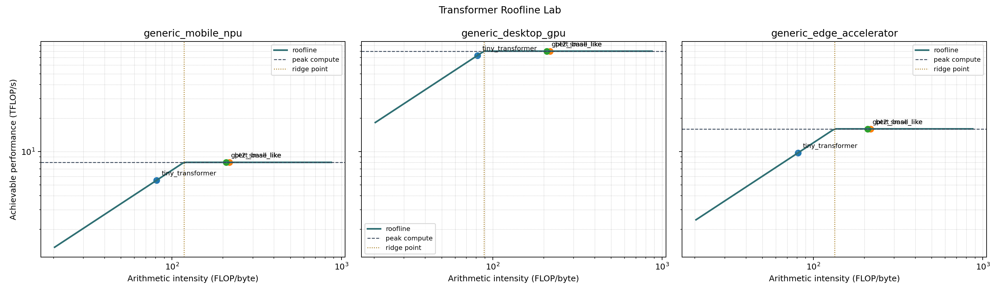

# Transformer Roofline Lab

**A lightweight Python lab for modeling compute and memory bottlenecks in transformer workloads.**

Transformer Roofline Lab extends the original **FRAME — Fast Roofline Analytical Modeling and Estimation** project into a focused, reproducible educational tool for understanding how transformer workloads interact with accelerator-style hardware limits.

The project estimates:

- total FLOPs
- memory traffic
- arithmetic intensity
- achievable roofline performance
- estimated latency
- whether a workload is **compute-bound** or **memory-bound**

It then generates clean terminal tables, CSV outputs, and roofline plots for transformer-like workloads across illustrative hardware profiles.


---

## Demo



The roofline plot shows where each transformer workload sits relative to a hardware profile’s memory-bandwidth slope and peak-compute ceiling.

Workloads to the left of the ridge point are typically **memory-bound**.  
Workloads to the right of the ridge point are typically **compute-bound**.

---

## Why this matters

Modern AI performance is not only about model size or raw FLOPs.

A transformer workload may be slow because:

1. the chip cannot do enough math fast enough, or
2. the chip spends too much time moving data from memory.

Roofline modeling gives a simple way to reason about this tradeoff.

```text
arithmetic intensity = FLOPs / bytes moved
````

High arithmetic intensity means the workload does a lot of math per byte loaded.
Low arithmetic intensity means the workload is more likely to be limited by memory bandwidth.

This is especially relevant for:

* edge AI inference
* mobile NPUs
* transformer acceleration
* hardware-aware ML optimization
* performance modeling
* accelerator design intuition

---

## What this project does

Transformer Roofline Lab provides a small, reproducible workflow:

```text
transformer workload config
        ↓
FLOP and memory estimation
        ↓
arithmetic intensity calculation
        ↓
roofline performance estimate
        ↓
compute-bound / memory-bound classification
        ↓
CSV + plot + benchmark summary
```

Example output:

```text
workload             hardware                       TFLOPs   GB moved    AI FLOP/B   achv TFLOP/s     lat ms bound
-----------------------------------------------------------------------------------------------------------------------
tiny_transformer     generic_mobile_npu               0.00       0.01        81.17           5.52       0.16 memory-bound
bert_base_like       generic_mobile_npu               0.10       0.44       217.87           8.00      12.08 compute-bound
gpt2_small_like      generic_mobile_npu               0.21       1.02       208.59           8.00      26.58 compute-bound
```

---

## Included transformer workloads

Example workloads live in:

```text
examples/transformer_workloads.py
```

Current examples:

* `tiny_transformer`
* `bert_base_like`
* `gpt2_small_like`

Each workload specifies transformer-style parameters such as:

* batch size
* sequence length
* hidden dimension
* number of layers
* number of attention heads
* MLP expansion ratio
* datatype size

---

## Included hardware profiles

Illustrative hardware profiles live in:

```text
src/hardware_profiles.py
```

Current profiles:

* `generic_mobile_npu`
* `generic_desktop_gpu`
* `generic_edge_accelerator`

Each profile contains:

* peak compute throughput
* memory bandwidth
* short descriptive notes

These profiles are meant for educational comparison, not product benchmarking.

---

## Quickstart

### macOS / Linux / WSL

```bash
git clone https://github.com/clouds1729/transformer-roofline-lab.git
cd transformer-roofline-lab

python3 -m venv .venv
source .venv/bin/activate

python -m pip install --upgrade pip
python -m pip install -r requirements.txt

python scripts/run_transformer_roofline.py
python scripts/plot_roofline.py
python -m pytest
```

### Windows PowerShell

```powershell
git clone https://github.com/clouds1729/transformer-roofline-lab.git
cd transformer-roofline-lab

python -m venv .venv
.\.venv\Scripts\python.exe -m pip install --upgrade pip
.\.venv\Scripts\python.exe -m pip install -r requirements.txt

.\.venv\Scripts\python.exe scripts\run_transformer_roofline.py
.\.venv\Scripts\python.exe scripts\plot_roofline.py
.\.venv\Scripts\python.exe -m pytest
```

### One-command demo on macOS / Linux / WSL

```bash
bash scripts/reproduce_demo.sh
```

---

## Generated outputs

Running the demo creates:

```text
results/transformer_roofline_results.csv
results/plots/transformer_roofline.png
```

If enabled by the current script version, it may also generate:

```text
results/benchmark_summary.md
```

The CSV contains one row per workload/hardware-profile pair.

The plot visualizes each workload against the roofline curve for each hardware profile.

---

## How to interpret the plot

A roofline plot has two main regions:

```text
memory-bound region     compute-bound region
        /---------------------------
       /
      /
```

The sloped line is the memory-bandwidth limit.

The flat line is the peak-compute limit.

The ridge point is where the bottleneck changes.

```text
left of ridge point  -> memory-bound
right of ridge point -> compute-bound
```

In this demo:

* `tiny_transformer` is often memory-bound because it does not do enough computation per byte moved.
* `bert_base_like` and `gpt2_small_like` are often compute-bound because their matrix multiplications create higher arithmetic intensity.

---

## Project structure

```text
.
├── docs/
│   └── transformer_roofline_tutorial.md
├── examples/
│   └── transformer_workloads.py
├── results/
│   ├── transformer_roofline_results.csv
│   └── plots/
│       └── transformer_roofline.png
├── scripts/
│   ├── run_transformer_roofline.py
│   ├── plot_roofline.py
│   └── reproduce_demo.sh
├── src/
│   ├── hardware_profiles.py
│   ├── transformer_roofline.py
│   └── ...
├── tests/
│   └── test_transformer_roofline.py
├── requirements.txt
├── pyproject.toml
└── README.md
```

---

## Tests

Run:

```bash
python -m pytest
```

Current tests cover:

* FLOP and memory sanity checks
* arithmetic intensity calculation
* roofline bound classification
* workload validity
* output behavior

---

## Educational tutorial

For a walkthrough of the core concepts, see:

```text
docs/transformer_roofline_tutorial.md
```

The tutorial explains:

* peak compute
* memory bandwidth
* arithmetic intensity
* roofline models
* compute-bound vs memory-bound workloads
* why transformers stress both compute and memory
* limitations of this simplified model

---

## Limitations

This is a lightweight analytical model, not a production hardware simulator.

It does **not** model:

* cache behavior in detail
* kernel fusion
* compiler scheduling
* runtime overhead
* KV-cache effects
* tensor layout choices
* exact vendor hardware
* power or thermal constraints
* cycle-level execution

The goal is to provide an intuitive, reproducible roofline analysis workflow for transformer workloads.

---

## Original FRAME attribution

This project builds on the original FRAME project:

**FRAME: Fast Roofline Analytical Modeling and Estimation**

Original contributors:

* Sheng-Chun (Felix) Kao
* Suvinay Subramanian
* Abhimanyu Bambhaniya
* Tushar Krishna

Original citation:

```bibtex
@software{frame,
  author = {Kao, Sheng-Chun and Subramanian, Suvinay and Bambhaniya, Abhimanyu and Krishna},
  title = {{FRAME: Fast Roofline Analytical Modeling and Estimation}},
  url = {https://github.com/maestro-project/frame},
  version = {1.0.0},
  year = {2022}
}

